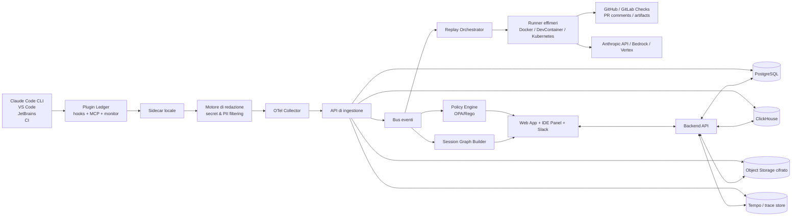

# Proposta di un servizio realmente nuovo per gli utenti di Claude Code

## Sintesi esecutiva

Claude Code, a metà 2026, è già un ambiente di coding agentico sorprendentemente esteso: funziona in terminale, IDE, desktop e browser; supporta plugin con skills, hooks, server MCP, server LSP e monitor; offre integrazioni con VS Code, JetBrains, GitHub Actions, GitLab, Slack, sessioni cloud sul web, routine schedulate, analytics native e monitoraggio via OpenTelemetry. In altre parole, il problema non è la mancanza di “potenza agentica”, ma l’assenza di un **layer operativo unificato** che renda il lavoro dei team riproducibile, trasferibile, governabile e conforme. citeturn19search1turn25view3turn25view8turn22search0turn22search1turn22search2turn25view6turn25view2turn25view1

L’opportunità più solida non è quindi creare “un altro coding assistant”, ma un **Claude Code Control Plane** con tre capacità che oggi non risultano offerte in modo integrato né da Anthropic né dalle alternative analizzate: **flight recorder sicuro**, **handoff/artifact di contesto trasferibili** e **replay deterministico in container effimeri con policy-as-code**. Questa proposta risponde a bisogni documentati: le analytics di contributo coprono solo gli utenti nell’organizzazione claude.ai, escludono l’uso via Console API e integrazioni terze, e non sono disponibili con Zero Data Retention; i canali sono ancora in anteprima di ricerca e non sono disponibili su Bedrock, Vertex AI o Microsoft Foundry; nelle sessioni cloud non esiste ancora uno store dedicato ai segreti; i transcript locali vengono conservati in chiaro sotto `~/.claude/projects/` per 30 giorni di default; e la documentazione ufficiale di Code Review chiarisce che le review non approvano né bloccano le PR. citeturn25view2turn28view0turn15search4turn26view0turn25view7

La proposta, che qui chiamerò **Claude Code Ledger**, si posiziona sopra Claude Code senza sostituirlo. Il prodotto cattura eventi e artefatti di sessione localmente, li redige/filtra prima della persistenza, li collega a git, CI e tracking dei costi, genera handoff riusabili fra sessioni e utenti, e può rilanciare task critici in runner riproducibili. Il valore è trasversale a sviluppatori, data scientist, team ML, DevEx, platform engineering e security/compliance. La forma commerciale consigliata è **open-core + SaaS + self-hosted enterprise**. citeturn25view3turn25view1turn25view5turn22search21turn6search2

## Bisogni non soddisfatti e panorama competitivo

### Dove Claude Code è già forte

Anthropic ha già coperto molte basi di prodotto. Il sistema plugin è ricco e ufficiale; il monitoraggio OTel esporta metriche, log/eventi e tracce; esistono impostazioni gestite per limitare strumenti, comandi, server e destinazioni di rete; le routine eseguono automazioni su infrastruttura Anthropic; la code review analizza le PR in contesto; e le estensioni IDE offrono piani, diff inline e cronologia conversazioni. Questo significa che una startup che provasse a competere sul “core agent loop” partirebbe in svantaggio. La zona bianca sta nella **operatività di team e nella continuità del contesto**, non nella capacità di generare codice. citeturn25view3turn25view1turn25view5turn25view6turn25view7turn25view8

### Dove restano i vuoti

I vuoti principali emersi dalla documentazione ufficiale e dalle issue pubbliche del repository sono cinque.

Primo: **continuità del contesto tra sessioni e utenti**. Le feature native come `CLAUDE.md`, auto-memory e `--resume` aiutano, ma non risolvono il passaggio strutturato di conoscenza tra sessioni, macchine e persone. Nelle issue pubbliche, gli utenti chiedono esplicitamente artefatti di contesto trasferibili e comunicazione tra sessioni parallele, segno che il bisogno è reale e non marginale. citeturn14search0turn30view1turn30view2

Secondo: **sicurezza locale e hygiene dei segreti**. La documentazione ufficiale Anthropic indica che i transcript vengono memorizzati localmente in testo semplice per 30 giorni di default; una feature request classificata nell’area security chiede esplicitamente secret scrubbing e rotazione dei log, descrivendo il rischio di accumulo di token, cookie e chiavi in chiaro nei file di sessione. Anthropic sta anche rafforzando l’area di sicurezza con nuove impostazioni come `sandbox.credentials`, aggiunta nel changelog del 23 giugno 2026, a conferma che il tema è vivo e in evoluzione. citeturn26view0turn30view0turn14search8

Terzo: **governance e analytics frammentate**. Le analytics di contributo non coprono l’uso via Console API o integrazioni terze, e spariscono con ZDR; i canali sono ancora preview-only e non funzionano sui provider cloud alternativi; nelle sessioni cloud manca uno store dedicato ai segreti, perché environment variables e setup scripts restano visibili a chi può modificare l’environment. Il risultato è che le organizzazioni più mature devono ancora assemblare da sole governance, DLP, audit, cost attribution e integrazione multi-provider. citeturn25view2turn28view0turn15search4

Quarto: **evidenza operativa verificabile nei flussi PR/CI**. Anthropic offre Code Review e GitHub/GitLab integration, ma la review non blocca la PR e il Quick Setup del GitHub App richiede permessi read/write su contenuti, issue e pull request. Per team regolati o con forte separazione dei ruoli, manca un prodotto che colleghi ogni modifica a prove riproducibili: contesto usato, test lanciati, esito del replay, decisioni, eccezioni di policy e costo associato. citeturn25view7turn8view8turn22search1turn22search6

Quinto: **coordinamento di lavoro parallelo**. La documentazione stessa raccomanda flussi con task in background, subagent e sessioni multiple; ma le issue aperte mostrano che la collaborazione inter-sessione è ancora un punto debole. Questo è particolarmente critico per monorepo, incident response, refactor multi-team e pipeline ML dove i task su codice, dati e infrastruttura si intrecciano. citeturn14search4turn14search5turn30view1

### Tabella comparativa delle funzionalità proposte rispetto alle soluzioni esistenti

La tabella seguente sintetizza cosa coprirebbe il prodotto proposto rispetto alle alternative oggi documentate. Le celle sono una sintesi analitica delle fonti ufficiali e, per i gap nativi di Claude Code, anche di issue pubbliche del repository. citeturn25view1turn25view2turn25view3turn25view5turn25view6turn25view7turn3search0turn3search3turn2search0turn2search8turn33search2turn33search0turn34search0turn34search2turn21search2turn21search3turn30view0turn30view1turn30view2

| Capacità | Claude Code Ledger | Claude Code nativo | Cursor Enterprise | Aider | Continue | Langfuse / Helicone |
|---|---|---:|---:|---:|---:|---:|
| Handoff strutturato tra sessioni, utenti e CI | **Sì** | Parziale | Parziale | No | No | No |
| Replay deterministico in container effimeri | **Sì** | No | Parziale | No | No | No |
| Policy-as-code su modelli, strumenti, rete e dati | **Sì** | Parziale | Parziale | No | Parziale | No |
| Secret/PII redaction prima della persistenza | **Sì** | Parziale | Parziale | No | No | No |
| Analytics unificate CLI + IDE + CI + API + terze parti | **Sì** | Parziale | Parziale | No | No | Parziale |
| Gate PR bloccante con bundle di evidenze | **Sì** | Parziale | Parziale | No | No | No |
| Deploy self-hosted o single-tenant EU | **Sì** | Parziale | Parziale | Sì | Sì | Sì |
| Flight recorder per audit e root-cause analysis | **Sì** | Parziale | Parziale | No | No | Parziale |

La lettura strategica della matrice è netta: Anthropic copre già il perimetro del coding agent, Cursor è più avanti sul piano enterprise della governance del proprio ecosistema, Aider e Continue restano forti come strumenti aperti e flessibili, e Langfuse/Helicone sono eccellenti come LLMOps generici. **Ciò che ancora non emerge come prodotto integrato è un control plane specifico per Claude Code che unisca contesto trasferibile, replay, policy e audit**. citeturn25view1turn25view2turn3search0turn3search3turn2search8turn33search2turn21search2turn21search3turn30view1turn30view2

## Prodotto proposto

### Definizione del servizio

**Claude Code Ledger** è un servizio composto da un plugin/sidecar locale e da un control plane centrale. Il plugin sfrutta i meccanismi nativi di Claude Code - hooks, monitor, server MCP e telemetria OTel - per osservare il lavoro dell’agente senza alterarne il core. Il control plane riceve eventi e artefatti già filtrati, li collega a commit, PR, issue, routine e sessioni CI, costruisce handoff strutturati e applica policy di sicurezza e compliance. La scelta architetturale è deliberata: **estendere Claude Code, non forkare Claude Code**. È il percorso con il minor rischio di manutenzione perché usa superfici già documentate e supportate. citeturn25view3turn25view1turn25view5turn22search21

### Target utenti rilevanti

Per gli **sviluppatori individuali**, il beneficio principale è poter congelare una sessione complessa in un artifact riapribile, trasferirla in CI o passarla a un collega senza riassumere tutto a mano. Questo riduce il costo di contesto e il rischio di “ripartire da zero”. citeturn30view2turn17search12

Per i **data scientist**, il problema non è solo il codice applicativo ma la propagazione del contesto tra notebook, script, pipeline di feature engineering e job schedulati. Qui Ledger aggiunge provenance, policy su dati e dipendenze, e replay in ambienti contenitizzati che aiutano a dimostrare da quali input e quali tool è emersa una modifica. citeturn25view6turn22search12turn15search8

Per i **team ML e MLOps**, il valore chiave è il collegamento tra sessione agentica, branch, run CI, asset di modello e validazione. In pratica: poter verificare che un suggerimento applicato dall’agente sia stato rieseguito nello stesso ambiente, con la stessa configurazione, prima di trasformarsi in merge o deploy. citeturn22search21turn22search10turn7search3

Per **DevEx, platform engineering, security e compliance**, Ledger serve a imporre policy, contenere il blast radius, controllare chiavi, rete e retention, esportare audit trail e attribuire spend/ROI per repo, team e workflow. Questo è esattamente il livello che la documentazione Claude Code copre solo in modo parziale con managed settings, analytics native e telemetria OTel. citeturn25view5turn25view2turn25view1turn10search0

### Casi d’uso prioritari

Il caso d’uso prioritario in un contesto software classico è **PR evidence bundle**: quando Claude Code interviene su una feature o un bugfix, il servizio genera automaticamente una scheda con commit collegati, file toccati, test eseguiti, policy applicate, deviazioni manuali, costo stimato e handoff umano leggibile. Claude Code già commenta le PR e può auto-fixare review comments o fallimenti CI nel cloud, ma non produce nativamente un fascicolo verificabile e bloccante da usare come gate. citeturn25view7turn22search10turn22search6

Il secondo caso d’uso è **incident-to-patch replay**. Un alert da monitoring o una failure CI viene instradato in una sessione o routine, il sistema congela l’ambiente, genera uno snapshot minimo del contesto rilevante e consente un replay identico in un runner effimero. Claude Code offre già canali, routine e monitor, ma i canali sono in preview e non sono disponibili su tutti i provider: per questo il replay deve poggiare su webhooks, OTel e runner controllati, non dipendere dai canali come prerequisito. citeturn28view0turn25view6turn27view0turn25view1

Il terzo caso d’uso è **multi-session coordination**. Su task complessi - refactor architetturali, migrazioni infrastrutturali, data pipeline, lavoro parallelo su worktree - serve una scratchpad condivisa e versionata che notifichi cambi critici agli altri agenti o alle persone. È un bisogno esplicitamente espresso nelle issue pubbliche di Claude Code. citeturn30view1

Il quarto caso d’uso è **secure export e knowledge transfer**. L’obiettivo non è archiviare tutta la conversazione, ma creare un artifact sintetico e importabile che contenga mappa del codebase, decisioni, scelte architetturali, open threads e risultati verificati. Questo riduce contesto sprecato, migliora il riuso e mitiga il costo dei resume fragili. citeturn30view2turn17search6turn17search12

### Funzionalità chiave da includere

Il nucleo di prodotto dovrebbe includere otto feature.

La prima è un **flight recorder locale** che legge eventi e segnali di sessione, ma esegue redazione e cifratura sul client prima di ogni persistenza o export. Questo è essenziale perché Claude Code conserva transcript locali in chiaro per 30 giorni di default. citeturn26view0turn30view0

La seconda è un **context pack trasferibile**, generato a checkpoint o fine sessione, che riassume decisioni, file letti, mapping architetturale e prossimi passi in un formato strutturato e reimportabile. citeturn30view2

La terza è una **policy engine** che applica regole su strumenti, modelli, destinazioni di rete, comandi bash, path sensibili, argomenti, provider e livelli di logging. Claude Code ha già permission rules e managed settings; Ledger deve estenderle con regole centralizzate e spiegabili, non reinventarle. citeturn25view5turn23search14turn15search11

La quarta è il **replay deterministico** in devcontainer o container effimero, con fingerprint di immagine, branch, commit, variabili, dipendenze e toolchain. Claude Code documenta esplicitamente dev containers e uso programmatico via Agent SDK: è il punto di aggancio corretto per un replay serio. citeturn15search8turn22search21turn8view9

La quinta è il **PR evidence bundle** con output leggibile da revisori umani: cosa è stato fatto, perché, con quali tool, con quali test, con quali eccezioni e con quali costi. Anthropic ha introdotto artifact web live, quindi esiste anche una metafora UX già comprensibile per presentare questi bundle. citeturn24search5turn25view7

La sesta è un modulo di **cost and risk attribution** che unisce token, modelli, durata, tool usage, failure rate e rischio di dato per repo, team, persona e workflow. Claude Code già esporta segnali OTel e Anthropic raccomanda Usage/Cost API per la fatturazione autorevole: la base tecnica esiste. citeturn25view1turn17search8turn19search0

La settima è una **shared project memory** a granularità repo/worktree, distinta da `CLAUDE.md` e auto-memory, pensata per coordinare più agenti e più persone. citeturn14search0turn30view1turn30view2

L’ottava è una **modalità EU/self-host** per clienti con requisiti GDPR forti, in cui il control plane gira nel tenant del cliente e Claude resta raggiunto tramite Anthropic API, Bedrock o Vertex AI. Claude Code supporta già provider terzi e Anthropic documenta ZDR e crittografia a riposo con provider cloud. citeturn8view3turn26view3turn4search7turn4search11

## Architettura tecnica e conformità

### Architettura consigliata

L’architettura migliore è una combinazione di **plugin Claude Code + sidecar locale + control plane centralizzato**. Il plugin usa hooks, monitor e server MCP per catturare eventi semantici e contesto di lavoro; il sidecar locale esegue redazione, fingerprinting e buffering; il collector OTel riceve metriche/log/tracce; il backend centrale archivia eventi e metadata, correla sessioni con git/CI, lancia replay su runner effimeri e pubblica bundle di evidenze in UI, IDE e PR. Questa scelta sfrutta funzioni ufficiali e stabili: plugin, OTel, Agent SDK, managed settings e CI integrations. citeturn25view3turn27view0turn25view1turn8view9turn25view5turn22search1turn22search6

I monitor nativi di plugin girano senza sandbox e allo stesso livello di fiducia degli hooks; inoltre i monitor di plugin non caricano nei project-scope plugin non trusted. Ciò implica che la logica sensibile - redazione, cifratura, policy evaluation e transport - non dovrebbe vivere in shell scripts sparsi, ma in un sidecar firmato e aggiornabile centralmente. citeturn27view0turn27view3

Il diagramma riflette solo componenti coerenti con le superfici documentate: OTel per osservabilità, plugin/hook/MCP/monitor per l’estensione locale, Agent SDK e CI/CD per l’automazione, managed settings per le policy, provider Anthropic/Bedrock/Vertex per l’esecuzione del modello, e runner containerizzati per il replay. citeturn25view1turn25view3turn27view0turn25view5turn22search21turn8view3

### Sicurezza, privacy e GDPR

Dal punto di vista GDPR, il servizio deve essere progettato per applicare **minimizzazione dei dati**, **protezione dei dati fin dalla progettazione e per impostazione predefinita**, e misure tecnico-organizzative adeguate di sicurezza. La Commissione europea ricorda che i dati personali devono essere adeguati, pertinenti e limitati a quanto necessario; l’EDPB enfatizza la privacy by design; e la guida EDPB sui rischi privacy degli LLM segnala esplicitamente il collegamento con gli articoli 25 e 32 e la possibile necessità di DPIA. citeturn31search3turn31search1turn5search13

In pratica questo significa che Ledger dovrebbe adottare questi principi operativi.

I dati di sessione devono essere classificati a monte in **telemetria non sensibile**, **metadata sensibili** e **contenuto ad alta sensibilità**. Per default vanno esportati solo segnali minimizzati, in linea con il fatto che la telemetria OTel di Claude Code non include prompt verbatim e tool content se non abilitati esplicitamente. citeturn16view3turn25view1

La redazione di segreti e PII va eseguita **prima** della persistenza, non solo prima dell’export. Questo è il punto chiave per mitigare il rischio creato dalla persistenza locale in chiaro dei transcript. citeturn26view0turn30view0

Per le chiavi API non è opportuno basarsi su scraping o riuso improprio dei token OAuth locali. Anthropic chiarisce che OAuth e API key hanno scopi differenti e che l’autenticazione OAuth è destinata all’uso ordinario delle applicazioni native. Per automazioni server-side, il design corretto è usare API key Claude Console, service account o provider cloud supportati. citeturn25view9turn4search5turn8view3

Nelle sessioni cloud, la documentazione Claude Code dice chiaramente che **non esiste ancora uno store dedicato dei segreti** e che variabili d’ambiente e script di setup sono visibili a chi può editare l’environment. Per questo MVP e GA dovrebbero offrire integrazione con KMS/Vault e credenziali effimere per runner, non chiedere mai agli utenti di inserire segreti persistenti nel layer di configurazione del prodotto. citeturn15search4turn10search6turn6search15

Sul piano CI/CD, le integrazioni cloud devono privilegiare **OIDC/workload identity federation** invece di secret statici, in conformità alle best practice GitHub per Actions e ai pattern ufficiali Google Cloud/Azure. citeturn7search9turn6search4turn6search16

### API e tecnologie consigliate

La pila tecnica consigliata è la seguente.

| Categoria | Scelta consigliata | Motivazione |
|---|---|---|
| Integrazione Claude | Plugin Claude Code + Agent SDK + Messages API | Massimo allineamento con superfici ufficiali |
| Osservabilità | OpenTelemetry Collector + OTLP | Claude Code esporta già metriche, log ed eventualmente trace |
| Policy | OPA/Rego | Policy-as-code spiegabili e versionabili |
| Database transazionale | PostgreSQL | configurazione, tenant, utenti, policy, mapping repo |
| Event analytics | ClickHouse | query rapide su eventi, costi, tool use, replay |
| Trace storage | Grafana Tempo o backend OTEL compatibile | correlazione sessione → tool → model call |
| Cache/queue MVP | Redis Streams o NATS JetStream | semplicità iniziale, bassa latenza |
| Orchestrazione replay | Docker/DevContainer per MVP, Kubernetes per scala | riproducibilità locale prima, HPA poi |
| Secrets | Cloud KMS + HashiCorp Vault | rotazione, audit, credenziali effimere |
| Frontend | Next.js / React | dashboard, bundle, diff, handoff viewer |
| Sidecar locale | Rust | footprint ridotto, sicurezza memoria, binario cross-platform |
| Backend | Go | ingestione OTLP, concurrency, servizi di controllo |

Queste scelte sono coerenti con l’ecosistema esistente: OTel è standard vendor-neutral; Kubernetes offre autoscaling orizzontale basato su metriche; Vault supporta credentiali dinamiche; e GitHub Apps/OIDC consentono integrazioni least-privilege. Sul lato Claude, prompt caching e token counting vanno usati fin dall’inizio per contenere costi e throughput. citeturn6search2turn6search1turn6search15turn7search5turn7search9turn19search0turn18search19turn17search6

## Flussi UX e MVP

### Flussi UX consigliati

Il primo flusso è **onboarding in IDE o terminale**. L’utente installa il plugin Ledger dal marketplace privato o via package manager, effettua login SSO verso il control plane, seleziona il repository, sceglie il profilo di policy e decide il livello di registrazione: solo metadata, metadata + tool parameters, o full evidence redatta. In VS Code l’esperienza ideale è un pannello laterale e una status line integrata, perché Claude Code offre già un modello UX simile con session list, revisione del piano e cronologia. citeturn25view8turn24search20turn25view5

Il secondo flusso è **lavoro normale di sviluppo**. Durante la sessione, il sidecar costruisce un grafo leggero della sessione: prompt checkpoint, file letti, tool chiamati, modifiche approvate, test lanciati, esiti e problemi di policy. L’utente vede un indicatore semplice: rischio, costo, stato del replay e qualità dell’evidenza. L’obiettivo UX non è “più dashboard”, ma togliere attrito: una badge verde deve significare “questa sessione è trasferibile e verificabile”. citeturn25view1turn23search19

Il terzo flusso è **handoff o passaggio di consegne**. L’utente seleziona “Crea context pack” e ottiene un artifact strutturato con titolo, sommario, decisioni, file importanti, TODO e regressioni note. Quel pack può essere reimportato da un’altra sessione, allegato a una PR, consumato da una routine o usato da un runner CI. È qui che il prodotto crea il proprio differenziale più netto. citeturn30view2turn25view6

Il quarto flusso è **PR / CI evidence**. Su apertura o aggiornamento della PR, Ledger arricchisce GitHub o GitLab con un check di evidenza: replay eseguito o non eseguito, policy violations, cost delta, test delta, artifact link, e stato “safe to review” o “needs human attention”. Claude Code già opera in GitHub e GitLab; Ledger aggiunge il livello di tracciabilità e blocking semantics che oggi manca. citeturn22search6turn22search1turn25view7

### Piano minimo prodotto

L’MVP non deve provare a risolvere tutto. Deve puntare a una forma minima, ma già “vendibile”, che faccia tre cose molto bene: **catturare**, **trasferire**, **riprodurre**.

L’MVP consigliato include questi moduli.

| Modulo MVP | Incluso | Motivazione |
|---|---|---|
| Plugin/sidecar CLI + VS Code | **Sì** | copre la maggior parte delle superfici usate |
| Ingestione OTel e metadata sessione | **Sì** | base per analytics e audit |
| Redazione segreti/PII pre-persistenza | **Sì** | requisito differenziante e urgente |
| Context pack trasferibile | **Sì** | risolve handoff e continuità |
| Replay runner Docker/devcontainer | **Sì** | prova il valore del prodotto |
| GitHub App con evidence check | **Sì** | migliora il flusso review/merge |
| Policy bundle base | **Sì** | rete, path sensibili, comandi, modelli |
| JetBrains plugin | No, fase beta | posticipabile |
| GitLab MR evidence | No, fase beta | utile ma non indispensabile al lancio |
| Slack / channels avançati | No, fase beta | non dipendere da preview feature |
| Multi-session coordination live | No, fase beta | funzionalità ad alta complessità |
| Self-hosted installer enterprise | No, fase GA | serve dopo validazione SaaS |

Questa delimitazione è coerente con lo stato delle superfici Anthropic: VS Code e CLI sono mature, plugin/OTel sono documentati, mentre canali e routine evolvono ancora rapidamente. Legare l’MVP a preview o feature allowlisted aumenterebbe inutilmente il rischio prodotto. citeturn25view8turn25view3turn25view1turn28view1turn22search13turn22search16

## Roadmap, costi e modello di business

### Roadmap di sviluppo

Le stime seguenti sono **inferenze progettuali** basate su una roadmap pragmatica, con un team iniziale di 4-6 figure tecniche core. I costi sono fully loaded e **non** rappresentano listini di mercato o preventivi cloud.

| Milestone | Durata stimata | Output principale | Team medio | Costo stimato |
|---|---|---|---|---:|
| Discovery, sicurezza e design | 3 settimane | threat model, policy model, UX flows, schema eventi | 1 PM, 1 Staff Eng, 1 Designer, 1 Sec Eng part-time | €30k-€45k |
| MVP alpha | 8-10 settimane | sidecar CLI/VS Code, ingestione OTel, redazione, context pack, replay Docker | 3-4 Eng, 1 Designer PT, 1 PM PT | €140k-€210k |
| Beta privata | 8-10 settimane | GitHub App, evidence bundle, policy engine, dashboard cost/risk | 4-5 Eng, 1 QA, 1 PM | €170k-€260k |
| Beta estesa | 6-8 settimane | multi-tenant SaaS, SSO, audit export, Slack notifier, metriche team | 5-6 Eng, 1 SRE, 1 PM | €160k-€260k |
| GA enterprise | 10-12 settimane | self-host/single-tenant, JetBrains, GitLab, HA, DSR/GDPR workflows | 6-7 Eng, 1 SRE, 1 Sec Eng, 1 PM | €260k-€420k |

Con una traiettoria disciplinata, il prodotto può arrivare a una **beta privata in circa 4-5 mesi** e a una **GA enterprise in 7-9 mesi**, con investimento complessivo nell’ordine di **€760k-€1,2M**. La forbice si amplia se si include un forte lavoro legale/compliance, pen-test esterni o un self-hosted installer supportato già nella prima release.

### Stima dei costi operativi

Il costo variabile principale lato AI dipende dalle funzioni di sintesi, handoff e classificazione che Ledger eseguirà. Se si adotta un routing pragmatico - Haiku 4.5 per classificazione e Sonnet 4.6 per summarization/handoff/replay explanations - il costo per seat può essere mantenuto relativamente basso. Anthropic pubblica prezzi di riferimento pari a **$1/$5 per MTok** per Haiku 4.5 e **$3/$15 per MTok** per Sonnet 4.6, con prompt caching e cache hits a costo ridotto; per alcuni modelli, i cached input tokens non contano verso i rate limits. citeturn19search0turn17search6turn17search3

Assumendo, per **monthly active seat**, un consumo Ledger di circa **0,5-1,0 MTok input + 0,1-0,25 MTok output** su Sonnet e **0,5 MTok input + 0,1 MTok output** su Haiku, il costo AI addizionale ricade grossolanamente in una fascia di **$6-$12 per seat/mese**. A quel punto la struttura complessiva può essere stimata così.

| Scala | Seat attivi/mese | Costo AI stimato | Costo piattaforma stimato | Totale operativo stimato |
|---|---:|---:|---:|---:|
| Pilot | 50 | $300-$600 | $1.5k-$3k | $1.8k-$3.6k/mese |
| Team medio | 200 | $1.2k-$2.4k | $4k-$8k | $5.2k-$10.4k/mese |
| Enterprise | 1000 | $6k-$12k | $12k-$25k | $18k-$37k/mese |

La parte “piattaforma” include collector OTel, API backend, object storage cifrato, Postgres, ClickHouse, trace storage, job worker e runner containerizzati; la parte “AI” dipende dai prezzi Anthropic e beneficia direttamente di token counting, caching e model routing. citeturn25view1turn18search19turn19search0turn17search6

### Modello di business e pricing

La combinazione più sensata è **open-core + SaaS + self-hosted enterprise**.

La componente **open source** dovrebbe includere il sidecar locale, il formato del context pack, i redattori base, e un collector locale single-user. Questo accelera fiducia, adozione e integrazione in ambienti tecnico-esigenti, soprattutto perché il tema centrale è il trattamento di codice, segreti e telemetria agentica.

La componente **SaaS freemium** dovrebbe offrire un piano gratuito per uso personale o piccoli team, con retention corta e dashboard base. Il piano **Pro/Team** può stare in una fascia **€15-€25 per seat/mese** per singoli o piccoli team e **€39-€69 per seat/mese** per team con GitHub evidence, policy bundle e dashboard cost/risk. L’**Enterprise** dovrebbe prevedere un minimo annuale con opzioni single-tenant, self-hosting, supporto premium, regioni EU e DPA/SLA. La monetizzazione non dovrebbe basarsi su markup opaco dei token, ma su valore di compliance, replay e governance.

In sostanza, il cliente compra tre cose: **riduzione del costo di contesto**, **auditabilità dei cambiamenti agentici** e **controllo del rischio**. È una value proposition diversa da quella degli IDE AI tradizionali.

## KPI, rischi e fonti principali

### Metriche di successo e KPI

I KPI migliori non sono solo di adozione, ma di **qualità operativa**.

Sul fronte adozione servono: percentuale di sessioni registrate sul totale, MAU/WAU per repo, numero di context pack creati e riutilizzati, tasso di installazione attiva del plugin, quota di PR con evidence bundle allegato. Anthropic stessa mette in evidenza DAU, sessioni, righe accettate e metriche di contributo come indicatori utili, quindi la logica è coerente con il lessico già familiare ai buyer. citeturn25view2

Sul fronte produttività servono: riduzione del tempo medio di review per PR, riduzione del tempo di handoff, riduzione dei resume costosi, percentuale di replay che evita rework, e delta tra cycle time con e senza context pack. Poiché Anthropic documenta che prompt caching e compaction riducono il costo di contesto, questi KPI sono economicamente rilevanti, non decorativi. citeturn17search6turn17search12

Sul fronte rischio servono: incidenti di secret leakage evitati, violazioni di policy intercettate prima del merge, falsi positivi della redazione, sessioni con contenuto non esportabile, percentuale di automazioni che usano OIDC invece di static secrets, e tempo medio di risposta a richieste di cancellazione/esportazione dati. citeturn30view0turn7search3turn7search9turn10search0

Sul fronte finanza servono: costo AI per seat, costo AI per PR assistita, costo per replay riuscito, rapporto costo/prevenzione di regressione, e ROI per team o repo. Le Usage/Cost API e l’OTel nativo di Claude Code forniscono già la materia prima tecnica per questa misurazione. citeturn17search8turn25view1

### Suggerimenti per test e monitoraggio

Il piano di test dovrebbe essere più severo di un normale SaaS web, perché qui si toccano codice, segreti, ambienti e policy.

Serve una suite di **test di redazione** con corpora realistici di token, JWT, secret cloud, cookie, PEM e PII, inclusi casi avversariali. Se la redazione fallisce, il prodotto fallisce nel suo principale differenziale.

Serve una suite di **test di replay** con repository di riferimento, immagini container pin, dataset di file sensibili e snapshot verificabili. Il criterio di successo non è “il comando gira”, ma “si ottiene la stessa evidenza sotto gli stessi vincoli”.

Servono **test di policy** per comandi, path, modelli, URL, provider e livelli di logging, con snapshot tests dei messaggi di explainability. La qualità della spiegazione è importante quasi quanto la correttezza della decisione.

Servono **test di carico** su ingestione OTel, builder di context pack, query ClickHouse e orchestrazione replay, con target iniziale di qualche migliaio di sessioni concorrenti e scaling graduale via HPA. citeturn25view1turn6search1

Servono **test di compliance**: export/delete per sessioni e artifact, rotazione chiavi, verifiche su data retention, segregazione tenant, e audit trail degli accessi ai secret store. Anche Anthropic, nella propria documentazione enterprise, insiste su audit logs, retention controls e ruoli granulari. citeturn10search0turn10search1turn10search8turn10search10

In produzione, il monitoraggio minimo dovrebbe coprire: ingest lag, failure rate del sidecar, queue depth, replay queue time, errore di correlazione sessione→PR, percentuale di pacchetti redatti con warning, percentuale di check bloccati da policy, disponibilità dei runner, saturazione ClickHouse/Postgres, e costo AI giornaliero per tenant. citeturn25view1turn6search2

### Principali rischi legali e tecnici

Il rischio legale principale è il **trattamento di codice e contenuti di sessione che possono contenere dati personali, segreti o IP sensibile**. Per questo il prodotto deve minimizzare, redigere, cifrare e limitare la persistenza. In parallelo, vanno previsti DPA, SCC quando necessari, region pinning e DPIA nei clienti più regolati. citeturn31search3turn31search1turn5search13turn10search9

Il secondo rischio legale è **l’uso improprio delle credenziali Anthropic**. Anthropic distingue tra OAuth per uso normale delle app native e API key per casi server-side o amministrativi: il prodotto deve rispettare questa separazione ed evitare pattern grigi come token harvesting dalle workstation. citeturn25view9turn15search1turn4search5

Il rischio tecnico principale è il **coupling con superfici ancora in rapida evoluzione**. Claude Code pubblica changelog frequenti e diverse funzioni sono ancora in anteprima di ricerca; ciò impone un design che dipenda il meno possibile da preview e che usi contratti interni versionati. citeturn22search13turn22search16turn28view1

Un altro rischio tecnico è il **blast radius dei plugin locali**. I monitor di plugin girano senza sandbox e gli hook eseguono codice sul sistema dell’utente: ciò obbliga a firmare i binari, ridurre al minimo i privilegi e mantenere la parte critica in un sidecar auditable. citeturn27view0turn25view5

Infine c’è il rischio di **frizioni UX**: se il prodotto interrompe troppo spesso il dev flow o produce troppi warning di redazione/policy, verrà disabilitato. Il design deve privilegiare progressive disclosure, soglie configurabili e explainability breve ma utile.

### Fonti principali

Ho privilegiato documentazione ufficiale e, dove disponibile, pagine in italiano di Anthropic e fonti istituzionali europee.

- **Anthropic Claude Code Docs**: panoramica, plugin, monitoring OTel, analytics, managed settings, routines, VS Code, Code Review, data usage, security e legal/compliance. citeturn19search1turn25view3turn25view1turn25view2turn25view5turn25view6turn25view8turn25view7turn26view0turn23search2turn25view9
- **Anthropic API / Admin / Pricing**: prezzi modelli, prompt caching, token counting, rate limits, Admin API, uso Cost/Usage API. citeturn19search0turn17search3turn18search19turn17search6turn4search5turn17search8
- **Supporto Anthropic Enterprise**: audit logs, retention controls, ruoli, ownership dei dati, security best practices per API key. citeturn10search0turn10search1turn10search6turn10search8turn10search9turn10search10
- **Repository pubblico anthropics/claude-code**: richieste utente su secret scrubbing, handoff trasferibile e coordinamento tra sessioni parallele. citeturn30view0turn30view1turn30view2
- **Soluzioni alternative ufficiali**: Cursor Enterprise, Aider, Continue, Sourcegraph, Langfuse, Helicone. citeturn3search0turn3search3turn2search0turn2search8turn33search2turn33search0turn34search0turn34search2turn21search2turn21search3
- **Sicurezza, cloud e compliance**: GitHub Actions security/OIDC, Kubernetes HPA, OpenTelemetry, Vault dynamic secrets, Commissione europea ed EDPB su minimizzazione e privacy by design. citeturn7search3turn7search9turn6search1turn6search2turn6search15turn31search3turn31search1turn5search13