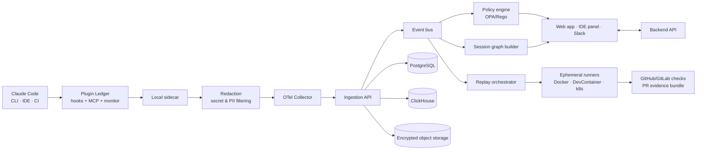

# Architecture - control plane (future work, not implemented)

The open-source core (capture · redact · pack · replay, all local) is deliberately self-contained. The research in [`deep-research-report.md`](../../deep-research-report.md) proposes a commercial **control plane** on top of it. This document records that target architecture as a scaffold so the OSS core stays decoupled from it - it is **not implemented in this repository** and requires cloud infrastructure that cannot ship as a local artifact.

## Target topology

## Integration seams with the OSS core

The OSS core is the *agent of record* on the developer's machine. The control plane consumes its outputs; the seams are intentionally narrow:

| Seam | OSS core provides | Control plane consumes |
|---|---|---|
| Events | redacted events in the SQLite store | export via OTel/OTLP or a push API |
| Context packs | versioned `pack` JSON (v1) | server-side handoff store + viewer |
| Replay | local `replaySession` + fingerprint | hosted ephemeral runners (Docker/k8s) |
| Policy | local capture opt-in + redaction | centralized OPA/Rego policy bundles |

## Components (not built here)

- **Ingestion API + event bus** - receive minimized signals (OTel) from sidecars.
- **Policy engine (OPA/Rego)** - central, explainable rules on tools/models/network/paths.
- **Replay orchestrator** - run captured commands in pinned containers at scale.
- **PR evidence bundle + blocking gate** - GitHub/GitLab App that attaches verifiable evidence and can block merges.
- **Analytics** - ClickHouse for cost/risk/tool-use; dashboards in a Next.js app.
- **Multi-tenant, SSO, audit export, EU self-host** - enterprise concerns.

## Why it is out of scope for the OSS core

Each component needs hosted, stateful, multi-tenant infrastructure (Postgres, ClickHouse, object storage, runner fleets, identity). The OSS core delivers standalone value on a laptop and keeps a clean export boundary so the control plane can be built later without changing the capture/redaction contract.
