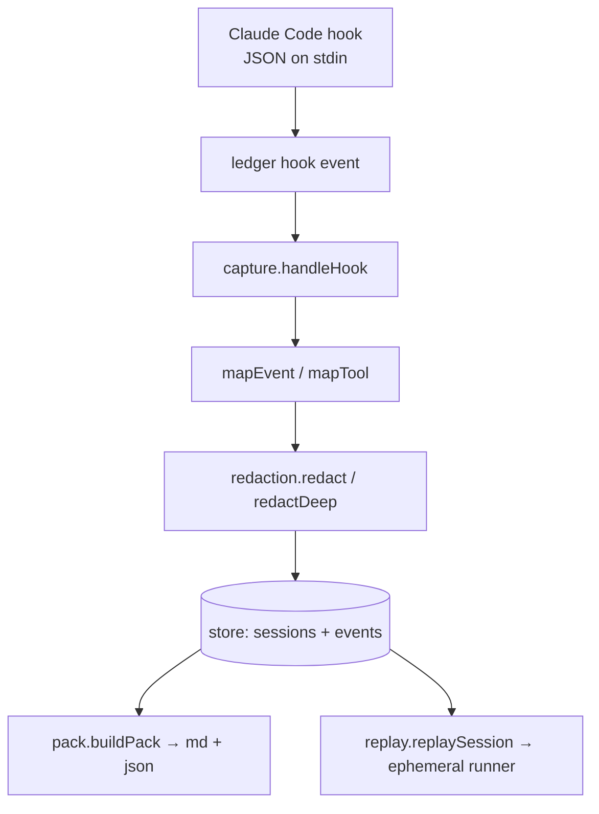

# Architecture - open-source core

The core is a single TypeScript/Node package that ships as both a `ledger` CLI and a Claude Code plugin. Storage uses Node's built-in `node:sqlite` (`DatabaseSync`) - no native dependencies.

## Modules

| Module | Path | Responsibility |
|---|---|---|
| config | `src/config.ts` | Resolve the per-repo `.ledger/` directory and paths |
| store | `src/store/` | `node:sqlite` schema + typed DAO for sessions/events |
| redaction | `src/redaction/` | Detect & redact secrets/PII (string + deep payload) |
| capture | `src/capture/` | Map Claude Code hook payloads → redacted events → store |
| pack | `src/pack/` | Build/render/import transferable context packs |
| replay | `src/replay/` | Re-run captured commands in an ephemeral fingerprinted dir |
| cli | `src/cli.ts`, `src/commands/` | `commander` wiring for all commands |

## Data flow

Capture never blocks Claude Code: the `hook` command swallows all errors and always exits 0. Capture is skipped unless the repo is initialized (`.ledger/` exists), unless `LEDGER_CAPTURE_AUTOINIT=1`.

## Data model

- **session** - `id`, `cwd`, `started_at`, `ended_at`, `git_branch`, `git_commit`, `meta`.
- **event** - `id`, `session_id`, `seq` (monotonic per session), `ts`, `type`, `tool`, `summary`, `payload` (redacted JSON), `redactions` (kind → count).

Event types: `session_start`, `session_end`, `prompt`, `tool_use`, `tool_result`, `file_read`, `file_edit`, `bash`, `test`, `note`.

## Design invariants

- **Redact before persist.** Every string that reaches the store passes through the redaction engine first.
- **Per-repo, local-first.** Data lives in `.ledger/` next to the code; nothing leaves the machine.
- **Stable seq.** Events are ordered by a per-session monotonic `seq`, independent of wall-clock ties.
- **Lossless packs.** A context pack embeds the full redacted events so it can be re-imported into another store.
